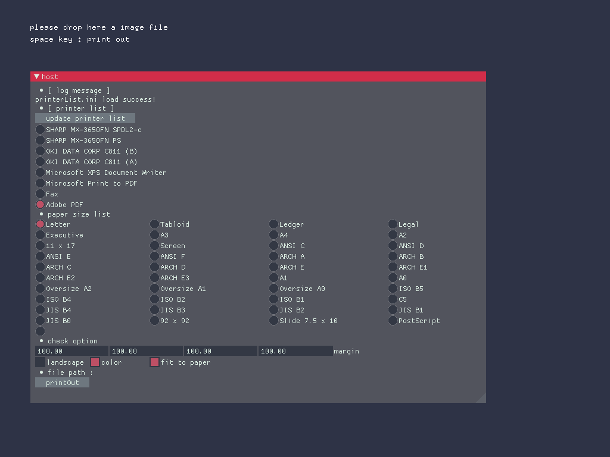

# ofxPrinter

### Overview
this addon is control a printing by openframeworks. 
you have to install PowerShell if you use this addon.

### Description
libs/powershell
please put this folder on directory path "'your openFrameworks projects'/bin/data/"

path sample
'your openframeworks projects'/bin/data/powershell

### Example

#### Requirement

ofxImGui

when you build for ofxPrinter-master
